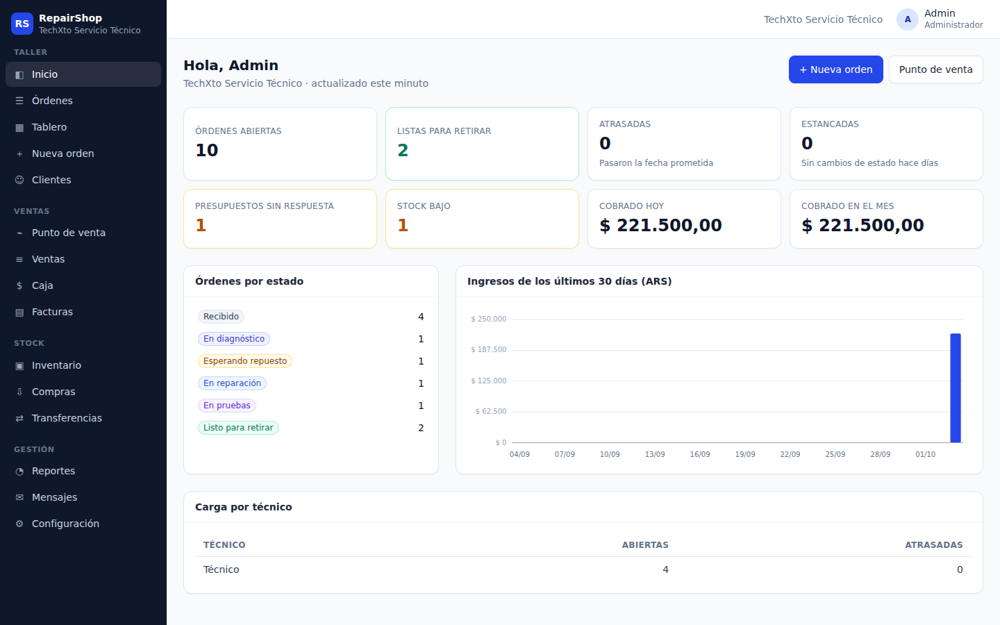
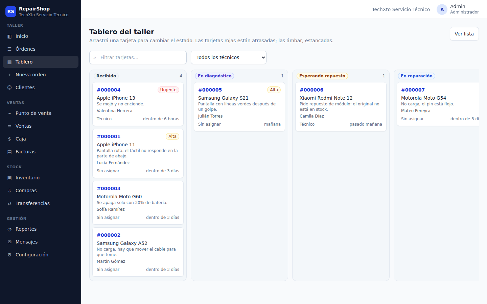
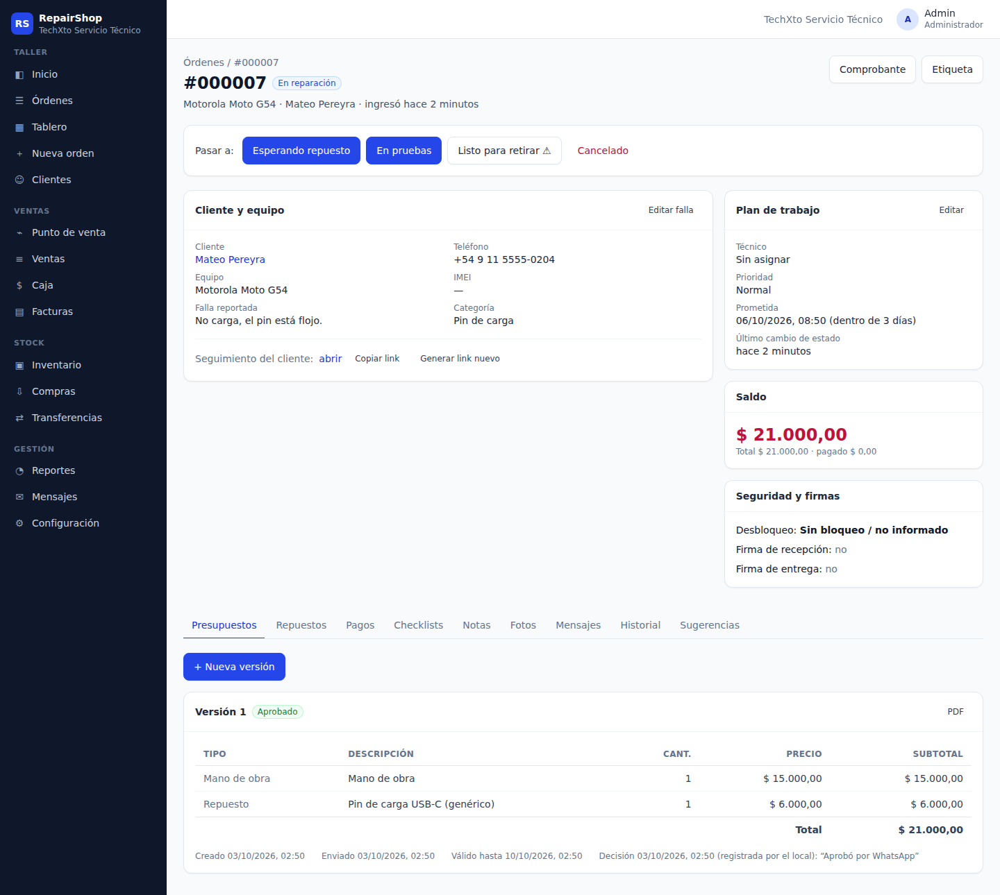
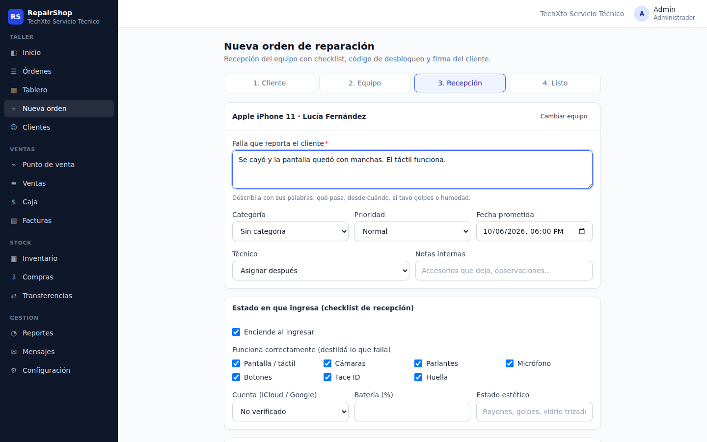
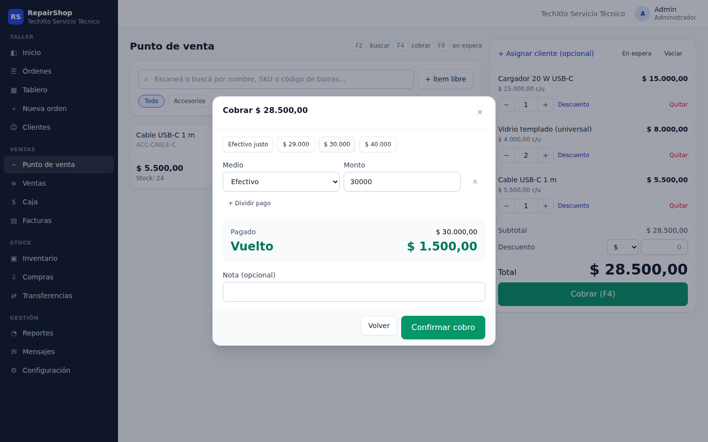
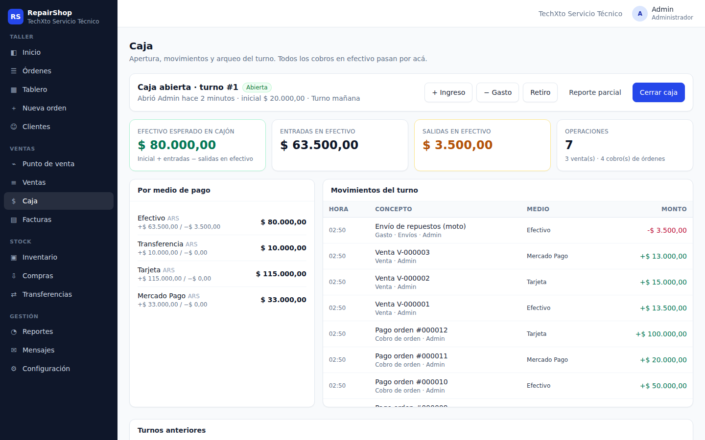
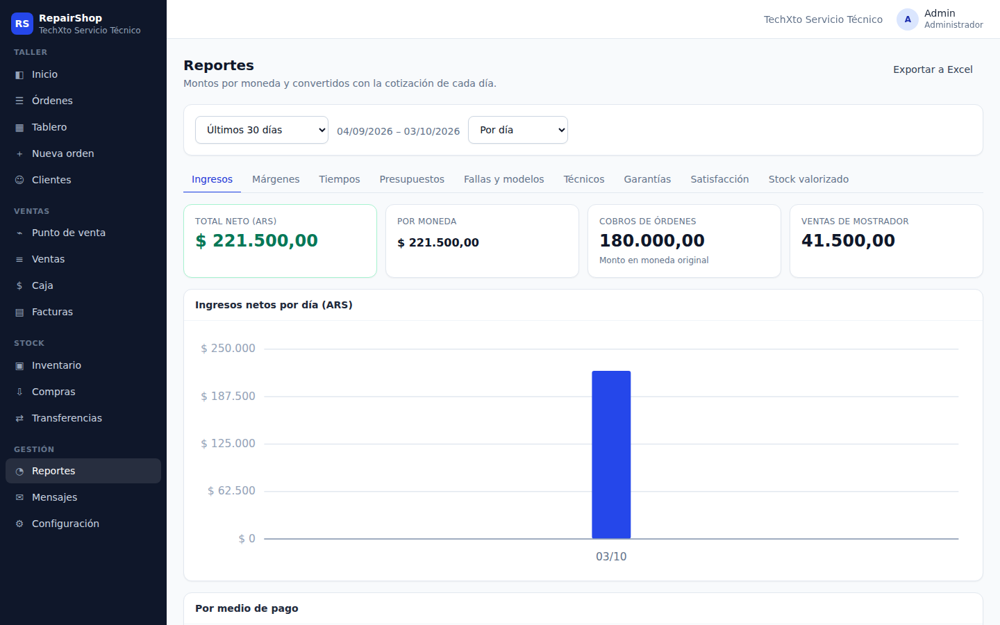
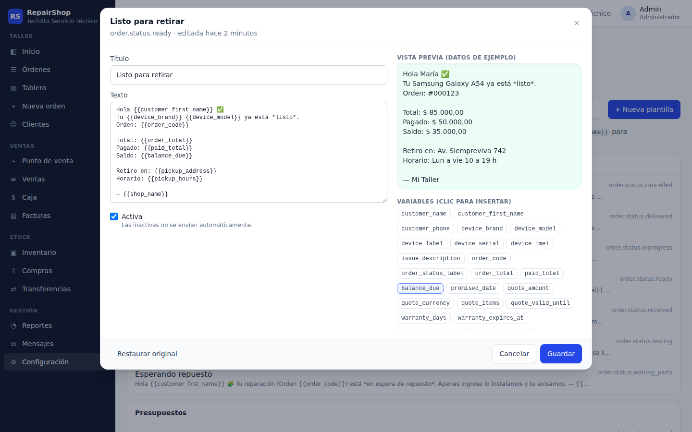
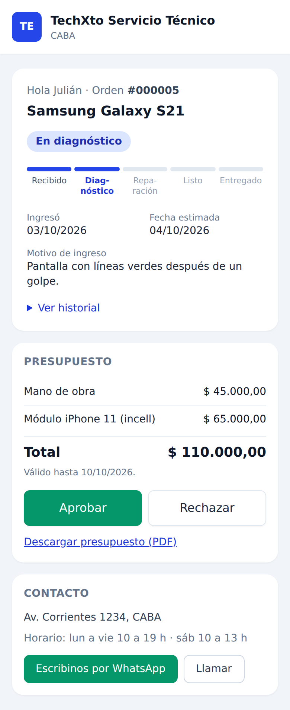

# RepairShop Management System

Full-stack management platform for phone and computer repair shops: device intake, repair orders with an enforced workflow, quotes approved by the customer online, inventory and purchasing, a point of sale with cash register control, Argentine e-invoicing (ARCA), automated customer messages, reports and a public tracking portal.

Built as a real business application for workshops in Argentina (Spanish UI, ARS/USD, Mercado Pago, ARCA), not a CRUD demo.



## What it solves

Small repair shops usually run on WhatsApp chats, paper tickets and spreadsheets: repairs get lost, customers keep asking "is it ready?", quotes are approved by voice, stock and cash never match, and nobody knows which technician or which repair is profitable.

RepairShop centralizes the whole cycle — **intake → diagnosis → quote → repair → QA → pickup → warranty** — and connects it with stock, sales, cash and invoicing.

## Features

**Workshop**
- Step-by-step intake: customer (duplicate detection by phone), device (IMEI validation), intake checklist, encrypted unlock code, customer signature, printable receipt and QR label.
- Repair orders with priorities, technicians, promised dates, a Kanban board and an [enforced state machine](backend/docs/workflows/order-state-machine.md): no repair without an approved quote, no "ready" without the exit QA checklist, no delivery with an outstanding balance.
- Versioned quotes (labor, parts, discounts, warranty, validity) approved or rejected by the customer from the portal; parts are reserved on approval.
- Payments, deposits, refunds, Mercado Pago payment links, notes (internal or public), photos, message history, warranty certificates and warranty claims.
- Repair suggestions from similar past orders and, optionally, diagnosis hypotheses from Claude (no personal data is sent).

**Sales and stock**
- Point of sale: USB or camera barcode scanning, catalog by category, free items, line and global discounts, split payments with change, held sales, keyboard shortcuts, tickets and invoices.
- Cash register shifts: opening float, income/expenses/withdrawals, per-method summary, bill counter, closing with differences and a PDF report.
- Inventory with available vs. reserved stock, low-stock alerts, adjustments and counts, device compatibility, purchase orders with partial receiving and transfers between branches.
- ARCA (AFIP) electronic invoices and credit notes; ARS/USD with daily exchange rates for reporting.

**Customers and management**
- Public tracking portal: progress timeline, quote approval, online payment, warranty, satisfaction survey and WhatsApp contact.
- Automatic messages from editable templates (WhatsApp via Twilio or Meta, email via SMTP) with an outbox that retries, pickup reminders and surveys.
- Reports: revenue, margins, time per status (bottlenecks), quote approval rate, top issues and models, technicians, warranty re-entry rate, satisfaction and inventory value — exportable to Excel.
- Multi-branch organizations, users invited by link, four roles (admin, technician, reception, cashier), audit log.

## Screenshots

| | |
| --- | --- |
|  |  |
| Kanban board | Order with an approved quote |
|  |  |
| Device intake | Point of sale checkout |
|  |  |
| Cash register | Reports |
|  |  |
| Message templates with preview | Customer portal (mobile) |

More in [`docs/screenshots`](docs/screenshots).

## Architecture

```txt
React SPA (Vite) ──/api/v1──▶ ASP.NET Core API ──▶ Application ──▶ Domain
       ▲                           │                    │
 public portal                  Infrastructure ◀────────┘
                                   │  EF Core + PostgreSQL, outbox dispatcher, scheduled jobs,
                                   │  PDF/QR, Excel, S3/R2 files, Mercado Pago, ARCA, Claude
```

```txt
backend/
  src/RepairShop.Domain          # Entities and business rules (state machine, quotes, sales, cash, stock)
  src/RepairShop.Application     # Use cases, contracts, permissions, reports
  src/RepairShop.Infrastructure  # EF Core/PostgreSQL, repositories, integrations, documents, jobs
  src/RepairShop.Api             # Controllers, auth, validation, ProblemDetails, rate limiting
  tests/                         # Domain, application and API integration tests (real PostgreSQL)
frontend/
  src/api        # Typed API client (in-memory access token, refresh cookie)
  src/features   # Orders, customers, POS, cash, inventory, reports, settings, portal…
  src/components # UI kit, charts, domain widgets
  e2e/           # Playwright end-to-end tests
```

Key decisions:
- **Clean Architecture** with business rules in the domain and a global tenant filter per branch.
- **Security**: 15-minute JWT kept in memory + rotating refresh token in an httpOnly cookie with reuse detection; login rate limiting and lockout; secrets encrypted with Data Protection; signed URLs for files; audit log.
- **Reliability**: idempotency keys on payments and sales, optimistic concurrency (PostgreSQL `xmin`) on orders, stock and cash, a message outbox with automatic retries, background jobs coordinated with advisory locks.
- **Operations**: structured logging with correlation ids, `/healthz` and `/readyz`, OpenTelemetry, a Docker image, automatic migrations (including an upgrade path for older databases).

## Getting started

Requirements: .NET 8 SDK, Node.js 20+, and Docker (or a local PostgreSQL 13+).

```bash
# API + PostgreSQL with demo data
cd backend
docker compose -f docker-compose.yml -f docker-compose.dev.yml up --build

# Web app (another terminal)
cd frontend
npm ci
npm run dev
```

Open http://localhost:5173 and sign in with a demo user:

| Role | Email | Password |
| --- | --- | --- |
| Admin | `admin@local` | `Admin123456` |
| Technician | `tech@local` | `Tech123456` |
| Reception | `recepcion@local` | `Recepcion123` |
| Cashier | `caja@local` | `Caja123456` |

API: http://localhost:8080 · Swagger: http://localhost:8080/swagger · Health: `/healthz`, `/readyz`.

Production deployment on a server with its own reverse proxy (web app, API, database and daily backups): [`deploy/README.md`](deploy/README.md). Configuration and integrations are documented in the [backend README](backend/README.md) and the [frontend README](frontend/README.md). Example configuration files: `backend/.env.example`, `backend/src/RepairShop.Api/appsettings.Example.json`, `frontend/.env.example`. Never commit real secrets.

## Tests and CI

```bash
# Backend: unit tests + API integration tests against PostgreSQL
cd backend
REPAIRSHOP_TEST_CONNECTION="Host=localhost;Port=5432;Username=postgres;Password=postgres" dotnet test

# Frontend: lint, unit/component tests, production build
cd frontend
npm run lint && npm test && npm run build

# End-to-end (needs the API running with demo data)
npm run test:e2e
```

GitHub Actions ([`.github/workflows/ci.yml`](.github/workflows/ci.yml)) runs the backend build and tests with a PostgreSQL service, the frontend checks, the Docker image build and the Playwright end-to-end suite (reception to delivery, point of sale and cash, purchasing and transfers, customer portal, role permissions and a smoke pass over every screen).

## Tech stack

- **Backend**: .NET 8, ASP.NET Core, EF Core 8, PostgreSQL 16, FluentValidation, Serilog, OpenTelemetry, QuestPDF, QRCoder, ClosedXML, MailKit, AWS SDK (S3/R2), Anthropic SDK, xUnit.
- **Frontend**: React 18, TypeScript, Vite, Tailwind CSS, TanStack Query, React Router, dnd-kit, Vitest, Testing Library, Playwright. Installable PWA.
- **Infrastructure**: Docker, Docker Compose, GitHub Actions.
