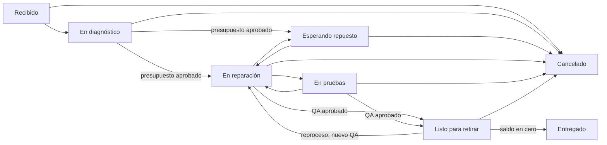

# State machine de órdenes

Estados, transiciones permitidas y reglas que el backend aplica a una orden (`RepairOrder`).

> Fuente de verdad: el dominio (`RepairOrder.AllowedTransitions` y `RepairOrder.MoveTo`) más los permisos de `ChangeOrderStatusService`. El frontend muestra solo lo que la API devuelve en `allowedNextStatuses` y explica de antemano por qué un paso está bloqueado, pero la API vuelve a validar todo.

## Estados

| Estado | Etiqueta | Significado |
| --- | --- | --- |
| `Received` | Recibido | Ingresó el equipo (checklist, firma y código de desbloqueo en la recepción). |
| `Diagnosing` | En diagnóstico | Se está revisando y presupuestando. |
| `WaitingParts` | Esperando repuesto | Presupuesto aprobado, falta un repuesto. |
| `InProgress` | En reparación | Trabajo en curso. |
| `Testing` | En pruebas | Pruebas antes del control de calidad. |
| `Ready` | Listo para retirar | Pasó el control de calidad; se avisa al cliente. |
| `Delivered` | Entregado | Final. Empieza a correr la garantía. |
| `Cancelled` | Cancelado | Final. Con motivo. |

## Diagrama

## Transiciones permitidas

| Desde | Hacia |
| --- | --- |
| `Received` | `Diagnosing`, `Cancelled` |
| `Diagnosing` | `InProgress`, `WaitingParts`, `Cancelled` |
| `WaitingParts` | `InProgress`, `Cancelled` |
| `InProgress` | `WaitingParts`, `Testing`, `Ready`, `Cancelled` |
| `Testing` | `InProgress`, `Ready`, `Cancelled` |
| `Ready` | `Delivered`, `InProgress`, `Cancelled` |
| `Delivered` | — |
| `Cancelled` | — |

## Reglas

1. **Presupuesto aprobado para reparar.** `Diagnosing → InProgress | WaitingParts` exige un presupuesto aprobado (por el cliente desde el portal o registrado por el taller) o un precio acordado en la orden. Los **reingresos por garantía** están exentos.
2. **Control de calidad para “Listo”.** Pasar a `Ready` exige el checklist de QA de salida aprobado. Si la orden vuelve de `Testing`/`Ready` a `InProgress` (reproceso), el QA anterior se invalida y hay que hacerlo de nuevo.
3. **Saldo en cero para entregar.** `Ready → Delivered` exige saldo pendiente ≤ 0. Solo un **administrador** puede forzar la entrega con saldo (`forceUnpaidDelivery`), y queda auditado.
4. **Caja solo entrega.** Un usuario con rol **Caja** solo puede registrar la entrega (`Delivered`).
5. **Al entregar**: se fija la garantía (días del presupuesto aprobado o de la sucursal) y su vencimiento, y se borra el código de desbloqueo cifrado.
6. **Al cancelar**: motivo obligatorio (máx. 300 caracteres, se informa al cliente), se liberan las reservas de stock, los presupuestos abiertos quedan reemplazados y se borra el código de desbloqueo.
7. **Estados finales**: `Delivered` y `Cancelled` no cambian más. Un problema posterior se maneja con un **reclamo de garantía**, que crea una orden nueva vinculada a la original.

## Efectos de cada cambio

- Se guarda en el **historial** (desde/hacia, usuario, motivo) y en la **auditoría**.
- Si se pide aviso al cliente, se encola un mensaje en el **outbox** con la plantilla del estado (`order.status.*`). El cambio de estado se confirma aunque el envío falle: el mensaje se reintenta en segundo plano y la API devuelve además el link de WhatsApp para enviarlo a mano.
- `Ready` inicia el reloj de retiro: los recordatorios automáticos usan los días configurados en la sucursal (`readyReminderDays`).
- El portal del cliente (`/t/:token`) refleja el estado y la línea de tiempo al instante.

## Errores típicos

- **400** con mensaje de negocio: transición inválida o regla incumplida (presupuesto, QA, saldo, motivo).
- **403**: el rol no puede hacer ese cambio (Caja fuera de la entrega, entrega forzada sin ser admin).
- **409**: otro usuario modificó la orden al mismo tiempo; recargá y reintentá.
- **500**: bug. Buscá el `correlationId` de la respuesta en los logs.
